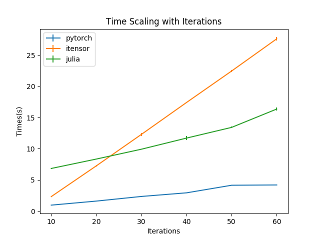
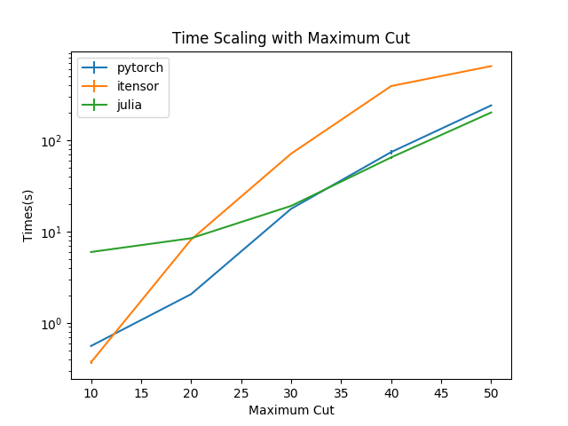

# Benchmark of Different Tenosr Implements

Currently, this test focus on three different implements: using pytorch; using julia and using itensor.

The result is

| Implement | Time(average over 10 runs) |
| --------- | -------------------------- |
| pytorch   | 1.6145774841308593s        |
| julia     | 8.993184804916382s         |
| itensor   | 7.370678853988648s         |

The scaling curve with iterations is



The scaling curve with maximum cuts is



## Details

This test is done on a mid 2014 MacBook Pro with a 2.2GHz Intel i7 processor and 16G of memory. And the pytorch test doesn't utilize a GPU. 

Library versions:

| name    | version                    |
| ------- | -------------------------- |
| pytorch | 1.0.0.dev20180921(nightly) |
| julia   | 1.01                       |
| itensor | 2.1.1                      |

To perform this test on your machine, run

```bash
python ./test.py
python ./testscaling.py
```

